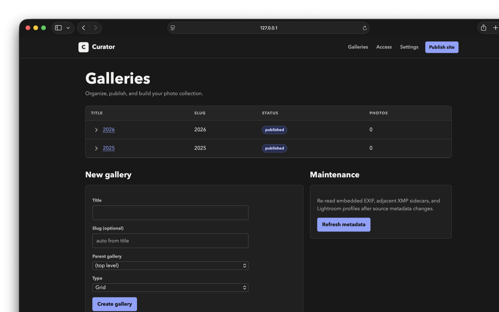
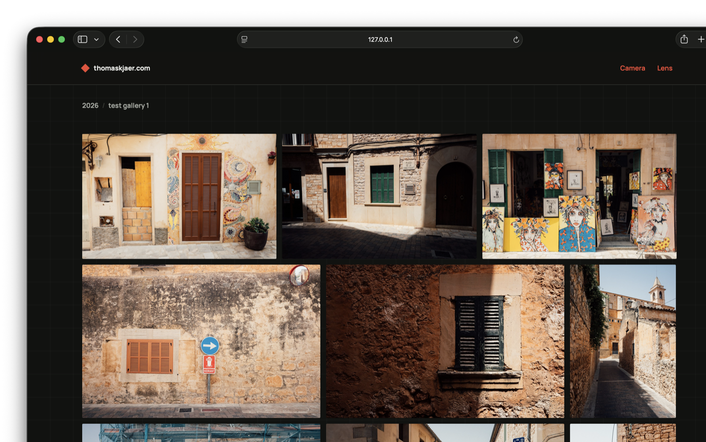

# Curator

Curator is a self-hosted photo gallery CMS written in Go. A local admin UI
manages galleries, photos, metadata, access, and publishing; the public site is
rendered as static HTML and images, with access-control configuration when
needed.

Curator supports hierarchical grid and story galleries, unlisted and protected
content, simple photo tags, automatic image resizing, EXIF facets, Atom feeds,
embedded themes, and publishing from Lightroom Classic.

Initial setup and Curator-specific settings live in the admin UI. Galleries and
photos can then be managed there or published day to day from Lightroom Classic.
The admin supports gallery hierarchies, contact-sheet review and ordering,
photo metadata overrides and tags, block-based story editing, presentation
defaults, access users, facets, themes, and publishing.

Photo tags can be entered in Curator or imported from embedded and sidecar XMP,
IPTC keywords, and Lightroom Classic. Curator tracks each assignment source so
metadata refreshes and Lightroom republishes do not erase tags entered in the
admin.

## Screenshots





## Quick start

Curator requires Go 1.26 or newer.

```sh
git clone https://github.com/tkjaer/curator.git
cd curator
go build -o curator .

./curator serve -content ./site
```

Open <http://127.0.0.1:8080/>. Curator creates the content root and database on
first launch, then the admin UI guides the rest of the setup. The content root
contains the SQLite database and original images; it is the source of truth and
should be backed up.

```text
site/
├── cms.db
├── originals/
└── output/
```

Set an admin password before exposing the admin through a reverse proxy:

```sh
./curator set-password -content ./site
```

## CLI and deployment

Curator can run on the server, with the web server serving its generated output
directory directly. It can also run entirely on a local computer and publish
only the generated output to a remote static host with `rsync`; the remote host
does not need Curator or access to the content database and originals.

The CLI is useful for automation and headless deployments. Publishing can also
be started from the admin UI. Configure an rsync destination under
**Settings → Publishing** and **Publish site** will build locally, then deploy
the generated output after a successful build. The machine running Curator
needs `rsync` and working SSH access to the destination.

Create a content root explicitly when not starting with `serve`:

```sh
./curator init -content ./site
```

Import a folder of images as a new gallery:

```sh
./curator import -content ./site -title "Summer trip" /path/to/photos
```

Re-read source EXIF and XMP metadata while preserving manual overrides:

```sh
./curator rescan -content ./site
```

Build the public site into `site/output`:

```sh
./curator build -content ./site
```

The output directory is disposable and can be served by any static web server.
To build and copy it to a remote host with `rsync`:

```sh
./curator publish -content ./site -target user@example.com:/srv/www/photos
```

Before enabling remote deletion, use **Settings → Publishing → Preview remote
changes** to see itemized uploads, updates, and stale files without changing the
destination. The equivalent CLI dry run is:

```sh
./curator publish -content ./site -target user@example.com:/srv/www/photos -no-build -dry-run -delete
```

To generate the Atom feed, configure the public base URL under
**Settings → Site**, then enable **Generate /feed.xml** under
**Settings → Publishing**.

Use `./curator help` for all commands and options.

## Camera and lens metadata

See the [camera and lens metadata guide](docs/lens-metadata.md) for replacing
scanner names with the camera that exposed the photo, correcting lens names,
tagging manual or adapted lenses, and configuring automatic resolution.

## Lightroom Classic

The publish-service plugin is in
[`lightroom/Curator.lrplugin`](lightroom/Curator.lrplugin). See the
[Lightroom setup guide](lightroom/README.md) for installation and token setup.
Once connected, Lightroom can drive the day-to-day publishing workflow:
collection sets become parent galleries, published collections become galleries,
and publishing synchronizes photos, ordering, metadata, and removals before
publishing the site, including rsync deployment when configured.

## Development

See [docs/development.md](docs/development.md) for running tests, starting the
admin locally, and previewing the generated site. See
[docs/architecture.md](docs/architecture.md) for the data model, generated site
layout, access-control setup, and design decisions.
