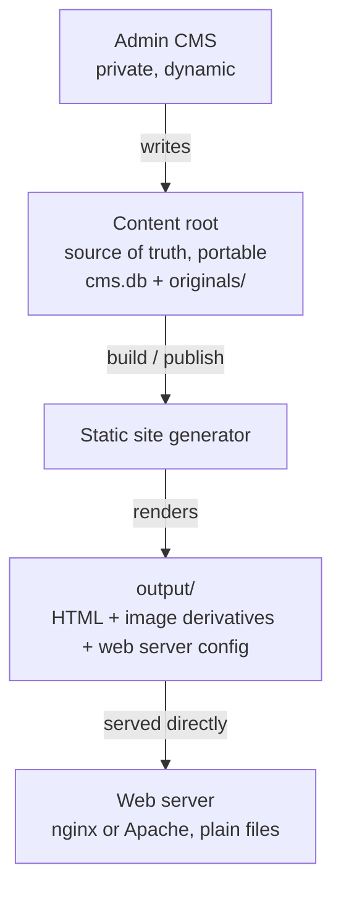

# Curator — Architecture

Curator is a photo gallery CMS. You manage photos and text in a private admin
application; Curator renders the public site to static files on disk. Nginx
serves those files directly — no application code sits in the public request
path.

It is the more advanced cousin of [tkjaer/gallery](https://github.com/tkjaer/gallery),
a simpler folder-driven static gallery generator. The two projects stay
separate; Curator is not a replacement for it.

## Goals

- A real CMS backend for the site owner and gallery managers.
- No CMS code in the public request path — the public site is static files.
- Themeable. Themes are the only user-facing extension surface.
- Publish / unpublish workflow: upload content that is reachable but unlinked,
  then publish it to be linked later.
- Hidden items (reachable by direct URL, absent from listings) and
  password-protected areas (enforced by the web server).
- Any aspect ratio as first-class (3:2, 4:3, 16:9, 1:1, …); layout uses each
  image's real dimensions. Wide panoramas (e.g. 65:24) are detected and can be
  handled specially.
- Grid galleries and blog-like "story" galleries, which can be mixed.
- Minimal, self-hosted front-end JavaScript. No external CDNs.

## Non-goals

- No RAW support. Input is JPEG (or other already-rendered exports).
- No plugin system. Functional changes are code changes; flexibility for the
  owner comes from themes and settings.
- Single site per installation.

## High-level shape



The same single Go binary runs the admin, the build, and (optionally) a local
preview server. Because it is one static binary plus a SQLite file, it can run
locally (build, then rsync `output/` to the server) or directly on the server
(build into the served directory). Only the output target differs.

## Content root and output layout

```
content-root/            # source of truth — back this up / rsync this
├── cms.db               # SQLite: all metadata, structure, ordering, settings
└── originals/           # uploaded full-resolution files (immutable)
    └── 2026/spring-trip/DSC_0491.jpg

output/                  # generated, disposable, fully rebuildable
├── index.html
├── galleries/…
├── browse/…             # facet pages (browse by camera, lens, …)
├── img/…                # image derivatives
├── assets/…             # theme css/js, self-hosted
└── nginx-locations.conf # auth_basic includes for protected galleries
```

Originals are never written into `output/`. Derivatives are a pure function of
(original bytes + preset) and can always be regenerated.

## Technology

- **Go** — single static binary; runs anywhere with no runtime dependencies.
- **`html/template`** — standard library, auto-escaping, for both the generated
  site and the admin UI.
- **SQLite** via a pure-Go driver (`modernc.org/sqlite`) — keeps the
  single-binary, no-cgo property.
- **libvips** (via `govips`) for image derivatives, with the option of a
  pure-Go imaging fallback. No RAW decoding.
- **Vanilla JS**, self-hosted, used only for progressive enhancement
  (lightbox, navigation). The site works without it.

## Deployment and access control

The public site is static, so password protection is enforced by the web server
against those files — no Curator code runs to serve a protected page. Curator
supports both nginx and Apache, selected by a `webserver` setting, and emits the
appropriate artifacts at build time for any protected gallery.

User accounts and password hashes are managed in the admin and stored in the
database; the `.htpasswd` files are generated during the build. The default hash
format is `apr1` (classic `htpasswd` MD5), which both nginx and Apache
understand on every platform; bcrypt is available for Apache-only setups.

**Apache** — self-contained and drop-in. Each protected directory gets a
`.htaccess` and `.htpasswd` beside its photos, so a plain rsync is enough (given
`AllowOverride AuthConfig`):

```apache
# output/galleries/private-trip/.htaccess
AuthType Basic
AuthName "Restricted"
AuthUserFile /srv/site/galleries/private-trip/.htpasswd
Require valid-user
```

**nginx** — cannot read `.htaccess`, so Curator emits the per-directory
`.htpasswd` files plus a single `curator-auth.conf` containing a location block
per protected gallery (the generator knows each gallery's URL path). It is
included once into the server block; rebuilds only rewrite that file:

```nginx
# output/curator-auth.conf — include once in server { }
location /galleries/private-trip/ {
    auth_basic "Restricted";
    auth_basic_user_file /srv/site/galleries/private-trip/.htpasswd;
}
```

This keeps password protection entirely in nginx; no application code runs to
serve a protected page.

## Visibility model

Two independent status fields decide what ends up public and linked:

- `gallery.status`: `draft | unlisted | published | protected`
- `item.status`: `draft | unlisted | published`

Effective visibility is the more restrictive of the gallery's and the item's
status:

- **draft** — not built to the public output at all.
- **unlisted** — built and reachable by direct URL, but not linked from any
  listing, and given an obscure slug. This is the "uploaded but not yet
  published" case.
- **published** — built and linked from listings and navigation.
- **protected** — built, but the containing location is guarded by nginx
  basic auth.

Protected and non-published photos are excluded from public facet indexes so
their existence is not leaked through browse pages.

## Data model

Everything is metadata in SQLite. Originals are path-stable on disk;
derivatives are a rebuildable cache.

```
GALLERY
  id, parent_id (nesting), slug, title, description,
  type (grid | story), status,
  cover_item_id, sort_mode (date | filename | manual),
  theme (optional override), password_realm (protected),
  published_at

ITEM
  id, gallery_id, original_path, filename,
  width, height, aspect (landscape | portrait | square | pano),
  highlighted, sort_order, status,
  caption (markdown), exif (json), taken_at

DERIVATIVE
  id, item_id, preset (thumb | display | w800 | w1600 | …),
  width, height, path, hash   # hash = hash(original + preset params)

BLOCK                          # ordered content within a gallery
  id, gallery_id, type (heading | text | quote | image | grid),
  item_id (for image blocks), content (markdown for text), sort_order

BLOCK_ITEMS                    # items shown by a grid block, ordered
  block_id, item_id, sort_order

TAG / TAG_MAP
  tag: id, namespace (user | camera | lens | aspect | …), value
  tag_map: tag_id, item_id
```

Key points:

- **Galleries nest** to arbitrary depth via `parent_id`.
- **Ordering** defaults to date taken, with by-filename and full manual
  override available per gallery (`sort_mode` + `sort_order`).
- **Cover image** is explicit (`cover_item_id`), falling back to the first
  highlighted item, then the first item.
- **Replacing an image** repoints `original_path`; derivatives regenerate
  because their `hash` changes.

### Galleries as blocks

A gallery's body is an ordered list of blocks. A grid is simply one block type,
so a "grid gallery" is a gallery whose single block is a `grid`, and a "story"
is a gallery with a mix of text, headings, quotes, images, and grids —
for example prose, a couple of large images, then a grid below.

Items belong to the gallery. A `grid` block references and orders a subset of
those items (via `BLOCK_ITEMS`); it does not own them. This keeps one item pool
per gallery and one justified-grid renderer shared by standalone grids and
in-story grids.

## Image derivatives

For each item, Curator generates a thumbnail, a display size, and a few
responsive widths from the original. Derivative filenames come from
`hash(original bytes + preset)`, so:

- Unchanged images cost nothing on rebuild.
- Replacing an image produces new derivative files; a later sweep removes
  orphans.
- `srcset` in the generated HTML is built directly from the presets.

## EXIF and facet browsing

EXIF is extracted once, when an image is ingested or replaced, and stored as
JSON on the item along with a few normalized columns (camera, lens, taken_at).

Facets are opt-in and configured in the admin. When enabled, Curator groups
published, non-protected items by facet value and emits browseable pages, e.g.
`/browse/camera/` and `/browse/camera/x-t5/`. Facets are implemented as tags in
a dedicated namespace, so manual tags and EXIF facets share one browse/render
path. The panorama aspect is applied as an automatic `aspect:pano` tag.

Because EXIF is already stored on each item, enabling a new facet later only
re-groups existing data — it does not re-read the original files. Only a change
to extraction itself would require re-reading originals.

## Configuration

All configuration lives in the database and is edited through the admin UI —
there is no config file to hand-edit. A `settings` table (key → JSON) holds
general and theme settings; structured tables hold facet configuration and
derivative presets. Theme options declared in a theme's `manifest.json` are
rendered automatically as admin form fields and stored under
`theme.<name>.*`.

## Build and publish

Builds are incremental. Editing anything marks the affected gallery dirty and
bumps a content version; publishing rebuilds the dirty set and regenerates only
derivatives whose hash changed. A build ledger records, per output artifact, a
source hash so unchanged pages and images are skipped, and an interrupted build
can safely resume.

Some changes intentionally trigger a wider rebuild — publish/unpublish and
top-level renames can affect navigation across the whole site — which is an
accepted trade-off for a simpler ledger. Routine edits (reordering, captions,
replacing an image, highlighting) stay local and fast.

Navigation is rendered from a small emitted sitemap so that most edits do not
dirty every page.

```
Edit in admin ─▶ mark gallery dirty, bump version
Publish ─▶ compute dirty set (galleries, ancestors' nav, affected facet pages)
        ─▶ rebuild dirty pages
        ─▶ regenerate only changed derivatives
        ─▶ write output, update ledger
```

## Themes

A theme is a self-contained directory and the only user-facing extension
surface. Themes never touch the database; the generator builds a plain
view-model for each page and executes the theme's templates with it. Stable
view-model field names are the contract between core and themes.

```
themes/<name>/
├── manifest.json        # metadata, declared options, required derivative presets
├── templates/
│   ├── layout.html
│   ├── gallery-grid.html
│   ├── gallery-story.html
│   ├── gallery-list.html    # sub-gallery listing (folder thumbnails)
│   ├── facet-index.html
│   ├── facet-value.html
│   └── partials/            # nav, breadcrumbs, figure, lightbox
├── assets/                  # theme.css, optional theme.js (self-hosted)
└── static/                  # favicon, self-hosted fonts, etc.
```

Curator ships one polished default theme that serves as the reference
implementation of this contract.

### Front-end approach

- **Justified grid**, computed at build time (target row height and container
  width), emitted with exact per-image widths. This yields a clean layout
  across 3:2, 1:1, and panoramic images with no client-side layout work and no
  layout shift. A CSS `aspect-ratio` layout is the fallback. Panoramas flow
  inline at full aspect by default; a theme option can force them to their own
  full-width row.
- **Responsive images** via `srcset`/`sizes` generated from the derivative
  presets, plus `loading="lazy"`.
- **Lightbox** using the native `<dialog>` element and a small vanilla script
  (previous/next, Esc, swipe). Without JavaScript, clicking a photo simply
  navigates to the larger image or the photo page.
- **Markdown** for captions and story text, sanitized to HTML at build time.

## Package layout (Go)

Single binary; everything lives under `internal/`.

```
internal/
├── store      # SQLite access and models
├── imaging    # derivative generation (libvips)
├── ingest     # import, EXIF extraction, facet tagging
├── render     # view models and page rendering (grid, story, facet)
├── build      # dirty-set computation, ledger, orchestration
├── admin      # HTTP handlers and templates for the CMS UI
├── theme      # theme loading, manifest, options
└── publish    # output targets (local dir; optional rsync helper)
```

## Coding principles

- KISS, DRY, YAGNI. No speculative abstraction; no interface with a single
  implementation unless it earns its place.
- Comments explain *why*, not *what*. Clear names and small functions over
  narration.
- Small, well-named packages with narrow surfaces.
- Pure, testable core logic where it matters: justified layout, dirty-set
  computation, and facet grouping should test without a database or filesystem.
- Idiomatic Go: wrap errors with context; add concurrency only where it clearly
  pays (derivative generation).
